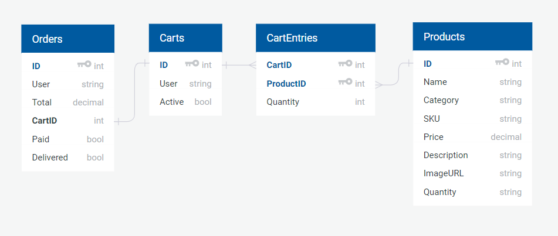
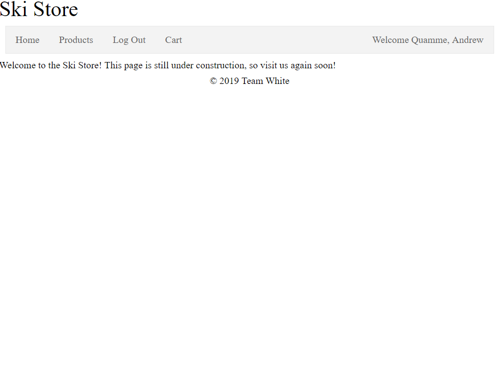
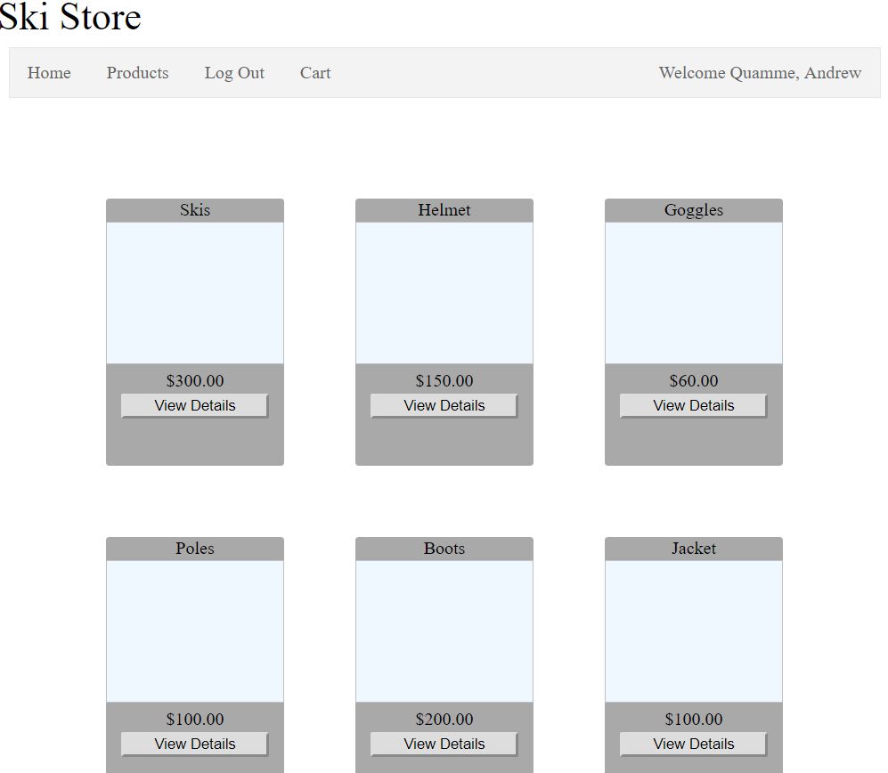
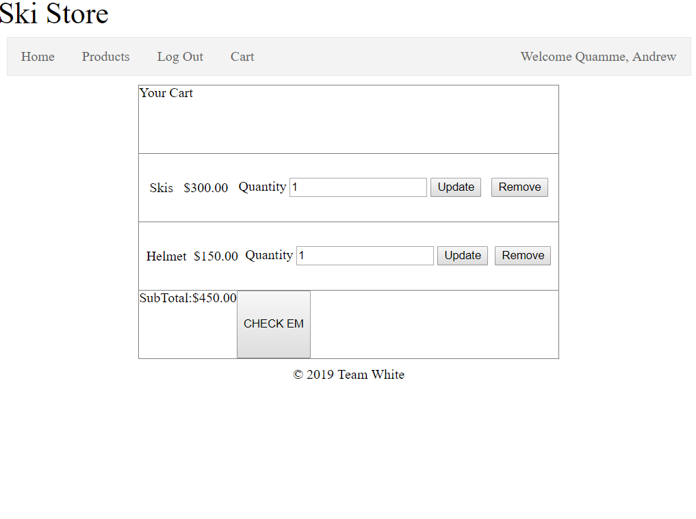

# SkiStore
This is an ECommerce application that simulates an online storefront for a wintersports retail and rental location.

## Deployed Site
https://skistore.azurewebsites.net/

## Summary
This application makes use of .NET Core Identity to store and handle user identity and gate access to certain pages
and functionality.

For each user, we capture claims for the user's name, phone number, email address, desired password, the user's date of birth, and whether or not the user agrees to our terms and conditions.

To access the Cart or any checkout functions, we enforce a policy that a user must be at least 18 years of age and have agreed to the waiver to rent or purchase equipment. It would be financially and legally irresponsible to allow underage users to purchase equipment for dangerous wintersport, and we want to do everything in our power to avoid liability for injuries sustained to our customers within the normal bounds of wintersport activity.

## Database Schema

The CartEntry table in our database joins the Cart and Product tables. Each Cart entry holds the UserID and unique CartID. The CartEntry table retains the products and quantities ordered associated with each Cart item. This will allow each user to have their own active cart that can be retrieved by logging in. When a purchase is made, the Cart becomes inactive but remains in the database. This will allow us to query for past orders in a future Sprint.
## Screenshots

